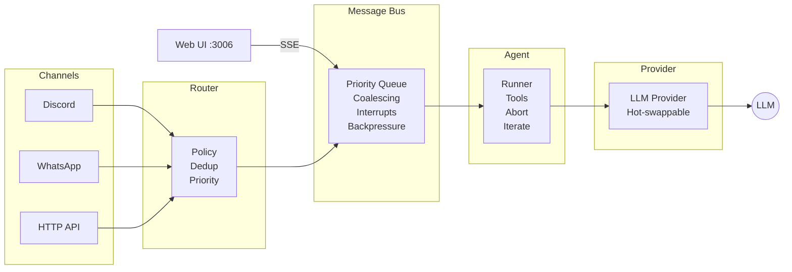

<div align="center">

# ⚡ Mach6

**AI agent framework. Single process. Any machine.**

[](LICENSE)
[](https://nodejs.org/)
[]()
[](https://www.typescriptlang.org/)

Sovereign AI agent framework — a persistent daemon that connects messaging platforms, LLM providers, and tool execution into a single agentic loop — with real-time interrupts, message coalescing, Blink continuation, and sub-agent orchestration. No Docker. No Redis. No cloud dependencies. **Your machine, your data, your keys.**

[Quick Start](#-quick-start) · [Architecture](#-architecture) · [Config](#-configuration) · [Providers](#-providers) · [Tools](#-tools) · [Web UI](#-web-ui)

</div>

---

## 🚀 Quick Start

```bash
# Clone & build
git clone https://github.com/Artifact-Virtual/mach6.git
cd mach6
npm install && npm run build

# Interactive setup — generates mach6.json + .env
npx mach6 init

# Start the daemon
node dist/gateway/daemon.js --config=mach6.json
```

> **Windows (PowerShell):** Same commands — Mach6 is fully cross-platform. Use `.\mach6.ps1` or `node dist/gateway/daemon.js --config=mach6.json`.

<details>
<summary><strong>Manual setup (without wizard)</strong></summary>

```bash
cp mach6.example.json mach6.json
cp .env.example .env
# Edit both files — set API keys, channel tokens, workspace path, ownerIds
```

</details>

---

## 🏗 Architecture



| Layer | What it does |
|-------|-------------|
| **Channels** | Discord (discord.js), WhatsApp (Baileys v7). Adapter pattern — add any platform. |
| **Router** | Policy enforcement, JID normalization, deduplication, interrupt detection, priority. |
| **Message Bus** | Priority queue with interrupt bypass, message coalescing, backpressure management. |
| **Agent Runner** | Agentic loop — tool calling, context management, abort signals, iteration limits. |
| **Providers** | Groq, Anthropic, OpenAI, Gemini, xAI (Grok), GitHub Copilot, Ollama, Gladius. Hot-swappable mid-session. |
| **Tools** | 18 built-in. File I/O, shell, browser, TTS, memory, process management, messaging. |
| **Sessions** | Persistent, labeled, TTL-aware. Sub-agent spawning up to depth 3. |

---

## 🔥 What Makes Mach6 Different

### Real-Time Interrupts

Most agent frameworks are request-response: you send a message, you wait, you get a reply. If the agent is mid-turn, your new message queues silently. You can't stop it. You can't redirect it.

**Mach6 doesn't work that way.** Every message is priority-classified in real-time:

```
interrupt  →  Bypasses queue. Cancels active turn immediately.
high       →  Skips coalescing. Next in line.
normal     →  Standard processing with coalescing.
low        →  Reactions, group mentions. Queued politely.
background →  Typing indicators. Dropped under backpressure.
```

Send "stop" while the agent is mid-thought → the agent stops. Immediately. Not after the current tool call. Not after the current paragraph. **Now.**

### Seamless Continuation (Blink + Pulse)

Most frameworks hard-cap iteration budgets. Hit the wall → session dies → context lost. Mach6 doesn't have walls.

**Blink** detects when the agent approaches its budget, spawns a fresh turn on the same session, and carries the full conversation forward. The user sees one continuous interaction. Up to 5 consecutive blinks with periodic checkpoint saves.

**Pulse** adapts the budget itself. Short conversations get 20 iterations (cheap). Complex tasks auto-expand to 100. When demand passes, it reverts. Cross-session state persistence means the budget carries across restarts.

### Native Memory (COMB)

Session-to-session memory, built into the engine. Zero external dependencies — no Python, no Redis, no database.

- **`comb_stage`** — save critical context for the next session
- **`comb_recall`** — retrieve it when the next session starts
- **Auto-flush** — conversation tail is saved automatically on shutdown

If a Python COMB stack exists (for enterprise deployments), the native version delegates to it transparently.

### Message Coalescing

Three messages in rapid succession? Mach6 buffers and merges them:

```
"hey"              → buffered
"can you"          → buffered
"check the logs"   → 2s timer expires → merged into one envelope
```

One coherent request, one turn, no wasted tokens.

### Single Process, Full Stack

One Node.js daemon runs everything — channels, routing, sessions, tools, providers, web UI. No Docker. No Redis. No Kubernetes. No microservices. The same binary runs on a $200 VPS or a bare-metal server. CPU-only, no GPU required. If it runs Node.js, it runs Mach6.

---

## ⚙ Configuration

### `mach6.json` — Agent configuration

```jsonc
{
  "defaultProvider": "groq",
  "defaultModel": "llama-3.3-70b-versatile",
  "maxTokens": 8192,
  "maxIterations": 25,
  "temperature": 0.3,

  // Use forward slashes on all platforms
  // Windows: "C:/Users/you/workspace"
  "workspace": "/home/you/workspace",
  "sessionsDir": ".sessions",

  "providers": {
    "groq": { "baseUrl": "https://api.groq.com/openai" },
    "anthropic": {},
    "openai": {},
    "gemini": {},
    "xai": {},
    "ollama": { "baseUrl": "http://127.0.0.1:11434" },
    "github-copilot": {},
    "gladius": { "baseUrl": "http://127.0.0.1:8741" }
  },

  "ownerIds": [
    "your-discord-user-id",
    "your-phone@s.whatsapp.net"
  ],

  "discord": {
    "enabled": true,
    "token": "${DISCORD_BOT_TOKEN}",
    "botId": "${DISCORD_CLIENT_ID}",
    "siblingBotIds": [],
    "policy": {
      "dmPolicy": "allowlist",
      "groupPolicy": "mention-only",
      "requireMention": true,
      "allowedSenders": ["your-discord-user-id"],
      "allowedGroups": []
    }
  },

  "whatsapp": {
    "enabled": true,
    "authDir": "~/.mach6/whatsapp-auth",
    "phoneNumber": "your-phone-number",
    "autoRead": true,
    "policy": {
      "dmPolicy": "allowlist",
      "groupPolicy": "mention-only",
      "allowedSenders": ["your-phone@s.whatsapp.net"],
      "allowedGroups": []
    }
  },

  "apiPort": 3006
}
```

All string values support `${ENV_VAR}` interpolation.

### `.env` — Secrets

```bash
# LLM Providers
GROQ_API_KEY=gsk_...           # https://console.groq.com/keys (free tier)
ANTHROPIC_API_KEY=sk-ant-...   # https://console.anthropic.com/
OPENAI_API_KEY=sk-...          # https://platform.openai.com/api-keys
GEMINI_API_KEY=AIza...         # https://aistudio.google.com/apikey
XAI_API_KEY=xai-...            # https://console.x.ai/

# GitHub Copilot — usually automatic via `gh auth login`
# COPILOT_GITHUB_TOKEN=

# Ollama — no key needed, just run `ollama serve`

# Discord
DISCORD_BOT_TOKEN=
DISCORD_CLIENT_ID=

# HTTP API authentication
MACH6_API_KEY=

# Port (default: 3006)
MACH6_PORT=3006
```

> Run `mach6 init` to generate both files interactively.

---

## 🧠 Providers

| Provider | Config Key | How it authenticates | Speed |
|----------|-----------|---------------------|-------|
| **Groq** | `groq` | `GROQ_API_KEY` env var | ⚡ Fastest (LPU hardware) |
| **Anthropic** | `anthropic` | `ANTHROPIC_API_KEY` env var | Fast |
| **OpenAI** | `openai` | `OPENAI_API_KEY` env var | Fast |
| **Gemini** | `gemini` | `GEMINI_API_KEY` env var | Fast |
| **xAI (Grok)** | `xai` | `XAI_API_KEY` env var | Fast |
| **GitHub Copilot** | `github-copilot` | Auto-resolved (see below) — no API key needed | Moderate |
| **Ollama** | `ollama` | Local HTTP endpoint — no key needed | Varies (local) |
| **Gladius** | `gladius` | Local HTTP endpoint | Local |

> **Recommended for getting started:** Groq — free tier, 280-1000 tok/sec, no credit card needed. [Get a key →](https://console.groq.com/keys)

### Groq models

| Model | Config value | Notes |
|-------|-------------|-------|
| Llama 3.3 70B | `llama-3.3-70b-versatile` | Best all-around (default) |
| Qwen3 32B | `qwen/qwen3-32b` | Strong reasoning |
| Llama 3.1 8B | `llama-3.1-8b-instant` | Ultra-fast, lighter tasks |

### xAI (Grok) models

| Model | Config value | Notes |
|-------|-------------|-------|
| Grok 3 | `grok-3` | Strongest reasoning |
| Grok 3 Fast | `grok-3-fast` | Lower latency |
| Grok 3 Mini | `grok-3-mini` | Lightweight + think mode |
| Grok 3 Mini Fast | `grok-3-mini-fast` | Fastest Grok |

### Gemini models

| Model | Config value | Notes |
|-------|-------------|-------|
| Gemini 2.5 Pro | `gemini-2.5-pro-preview-05-06` | Strongest reasoning, thinking support |
| Gemini 2.5 Flash | `gemini-2.5-flash-preview-04-17` | Fast + thinking |
| Gemini 2.0 Flash | `gemini-2.0-flash` | Fast, general purpose |
| Gemini 1.5 Pro | `gemini-1.5-pro` | Long context (1M tokens) |

> **Gemini thinking support:** Models with thinking enabled return `thoughtSignature` fields. Mach6 preserves these across tool call roundtrips automatically — required by the Gemini API for thinking-enabled sessions.

### GitHub Copilot token resolution

No API key required if `gh` CLI is installed and authenticated. Token resolves in order:

1. `COPILOT_GITHUB_TOKEN` env var
2. `~/.copilot-cli-access-token` file
3. `GH_TOKEN` / `GITHUB_TOKEN` env vars
4. `~/.config/github-copilot/hosts.json` (Linux/macOS)
5. `%APPDATA%\github-copilot\hosts.json` (Windows)
6. `gh auth token` CLI fallback (all platforms)

### Copilot proxy models

| Model | Config value |
|-------|-------------|
| Claude Opus 4.6 | `claude-opus-4-6` |
| Claude Sonnet 4 | `claude-sonnet-4` |
| GPT-4o | `gpt-4o` |
| o3-mini | `o3-mini` |

### Ollama (local models)

Runs locally — no API key, no cloud. Install from [ollama.ai](https://ollama.ai), pull a model, go:

```bash
ollama pull qwen3:4b
# Then set defaultProvider: "ollama", defaultModel: "qwen3:4b"
```

Providers are hot-swappable mid-session via `/provider` and `/model` commands.

---

## 🛠 Tools

18 built-in tools, available to the agent by default:

| Tool | Description |
|------|------------|
| `read` | Read file contents (with offset/limit for large files) |
| `write` | Write/create files (auto-creates parent directories) |
| `edit` | Surgical find-and-replace editing |
| `exec` | Execute shell commands |
| `image` | Analyze images with vision models |
| `web_fetch` | Fetch URLs, strip HTML to text |
| `tts` | Text-to-speech (Edge TTS, multiple voices) |
| `memory_search` | Hybrid BM25 + vector search over indexed files |
| `comb_recall` | Recall persistent session-to-session memory |
| `comb_stage` | Stage information for next session |
| `message` | Send messages, media, and reactions to any channel |
| `typing` | Send typing indicators |
| `presence` | Update presence status |
| `delete_message` | Delete messages |
| `mark_read` | Send read receipts |
| `process_start` | Start background processes |
| `process_poll` | Poll background process output |
| `process_kill` | Kill background processes |
| `process_list` | List background processes |
| `spawn` | Spawn sub-agents (up to depth 3) |

Tools are sandboxed per-session via the policy engine. MCP bridge available for external tool servers.

---

## 🖥 Web UI

Mach6 ships with a built-in web interface at `http://localhost:3006`:

- **Session management** — create, switch, delete sessions
- **Streaming responses** — real-time SSE with tool call visualization
- **Config panel** — change provider, model, temperature, API keys live
- **Sub-agent monitoring** — view and kill running sub-agents
- **Generative UI** — file reads, exec outputs, and fetches render as rich cards

No build step. No npm dependencies. One static HTML file.

---

## 🖥 CLI

### Interactive REPL

```bash
node dist/index.js --config=mach6.json
```

```
Mach6 v0.2 | github-copilot/claude-opus-4-6 | session: default
Tools (18): read, write, edit, exec, image, web_fetch, tts, ...
Type /help for commands

❯ What's in the logs?
⚡ exec
✓ exec tail -50 /var/log/syslog
...
```

### Commands

| Command | Description |
|---------|------------|
| `/help` | Show all commands |
| `/tools` | List available tools |
| `/model <name>` | Switch model mid-session |
| `/provider <name>` | Switch provider mid-session |
| `/spawn <task>` | Spawn a sub-agent |
| `/status` | Session stats (tokens, tool usage) |
| `/sessions` | List all sessions |
| `/history [N]` | Show last N messages |
| `/clear` | Clear current session |
| `/quit` | Exit |

### One-shot mode

```bash
node dist/index.js "Summarize the README in this directory"
```

---

## 🐧 Running as a Service

### Linux (systemd)

```bash
# Copy the included service file
sudo cp mach6-gateway.service /etc/systemd/system/
# Edit it — set your paths and user
sudo systemctl enable --now mach6-gateway

# Hot-reload config without restarting:
kill -USR1 $(pgrep -f "gateway/daemon.js")
```

### macOS (launchd)

Create `~/Library/LaunchAgents/com.mach6.gateway.plist` pointing to `node dist/gateway/daemon.js`.

### Windows

Use [NSSM](https://nssm.cc/) or Task Scheduler to run `node dist/gateway/daemon.js --config=mach6.json`.

> **Note:** `SIGUSR1` hot-reload is not available on Windows. Restart the process to reload config.

---

## 📁 Project Structure

```
mach6/
├── src/
│   ├── agent/          # Runner, context manager, system prompt builder
│   ├── boot/           # Boot sequence & validation
│   ├── channels/       # Adapter pattern — Discord, WhatsApp, router, bus
│   │   ├── bus.ts      # Priority queue, coalescing, interrupts, backpressure
│   │   ├── router.ts   # Policy, dedup, JID normalization, priority
│   │   └── adapters/   # Discord (discord.js), WhatsApp (Baileys v7)
│   ├── cli/            # Interactive setup wizard
│   ├── config/         # Config loader, validator, env interpolation
│   ├── cron/           # Cron budget management
│   ├── formatters/     # Platform-aware markdown formatting
│   ├── gateway/        # Persistent daemon — signals, hot-reload, turns
│   ├── heartbeat/      # Activity-aware periodic health checks
│   ├── memory/         # Index integrity checks
│   ├── providers/      # LLM providers — Groq, Anthropic, OpenAI, Gemini, xAI, Copilot, Ollama, Gladius
│   ├── security/       # Input sanitization
│   ├── sessions/       # Session store, queue, sub-agents
│   ├── tools/          # 18 built-in tools, policy engine, registry, MCP bridge
│   └── web/            # Web UI server (SSE streaming, static serving)
├── web/                # Web UI (single HTML file)
├── mach6.example.json  # Example config
├── .env.example        # Example environment variables
├── mach6.sh            # Linux/macOS start script
├── mach6.ps1           # Windows start script
└── mach6-gateway.service  # systemd unit file
```

---

## 🔒 Hardening

20+ production pain points addressed:

- **Blink** — seamless iteration budget continuation (no hard walls)
- **Pulse** — adaptive iteration budget (20 → 100 on demand, auto-reverts)
- **Native COMB** — lossless session-to-session memory, zero dependencies
- **Config validation** with human-readable diagnostics at boot
- **Context monitor** with progressive warnings (70/80/90% thresholds)
- **Priority message queue** — real messages never drop, only background signals shed under backpressure
- **Tool policy engine** — scope available tools per session and security tier
- **Provider diagnostics** — health checks and automatic failover
- **Activity-aware heartbeat** — adapts frequency to user activity state
- **Cron budget management** — jobs declare resource budgets, scheduler enforces daily limits
- **Boot sequence validation** — catch misconfigurations before they become incidents
- **Memory index integrity** — validates HEKTOR indices at startup, auto-rebuilds if corrupt
- **JID normalization** for WhatsApp Baileys v7 (device suffix stripping)
- **Abort signal propagation** through agent runner → LLM stream → tool execution
- **MCP bridge** for connecting external tool servers
- **MCP server mode** — expose Mach6 tools to external agents and editors
- **Sibling bot yield** — @mention one bot, only that one responds
- **Anti-loop system** — structural echo loop prevention in multi-bot environments

---

## 📊 Stats

| Metric | Value |
|--------|-------|
| Lines of TypeScript | ~15,000+ |
| Source files | 70+ |
| Built-in tools | 18+ |
| LLM providers | 8 |
| Channel adapters | 2 + HTTP API |
| Documentation files | 37 |
| Cold boot to connected | ~2.3s |
| External runtime deps | Node.js only |

---

## 🌐 Platform Compatibility

| Feature | Windows | Linux | macOS |
|---------|---------|-------|-------|
| Gateway daemon | ✅ | ✅ | ✅ |
| Discord adapter | ✅ | ✅ | ✅ |
| WhatsApp adapter | ✅ | ✅ | ✅ |
| HTTP API + Web UI | ✅ | ✅ | ✅ |
| CLI (REPL + one-shot) | ✅ | ✅ | ✅ |
| Hot-reload (SIGUSR1) | ❌ | ✅ | ✅ |
| Service manager | Task Scheduler | systemd | launchd |
| Temp directory | `%TEMP%` | `/tmp` | `/tmp` |
| Home directory | `%USERPROFILE%` | `~` | `~` |

All paths resolved via `os.tmpdir()` and `os.homedir()` — zero hardcoded Unix paths.

---

## 📜 History

| Date | Milestone |
|------|----------|
| **Feb 22, 2026** | Built from scratch. WhatsApp, Discord, gateway, config, tools, sessions. |
| **Feb 22, 2026** | 14/14 smoke tests. 20 hardening fixes. Flipped to production same day. |
| **Feb 23, 2026** | Open-sourced. MIT license. |
| **Feb 28, 2026** | Cross-platform (Windows/Linux/macOS). CLI wizard. v1.0.0. |
| **Mar 3, 2026** | Multi-bot coordination, ATM, sibling yield. v1.3.0. |
| **Mar 5, 2026** | MCP server, anti-loop, degradation protection. v1.4.0. |
| **Mar 6, 2026** | Blink, Pulse, COMB, 7 providers, agent wizard. v1.5.0. |
| **Mar 7, 2026** | Native Gemini provider, 8 providers, multi-user deployment. v1.6.0. |

---

## 📄 License

[MIT](LICENSE) — do whatever you want with it.

---

<div align="center">

Built by **[Artifact Virtual](https://artifactvirtual.com)**

Open-sourced because infrastructure wants to be free.

</div>
