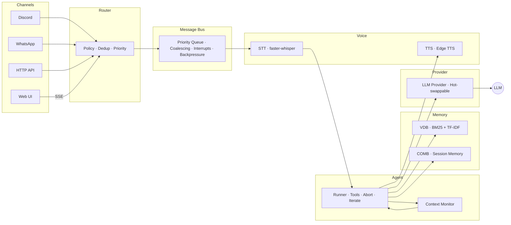

# Architecture

Symbiote is a single-process agent framework. Every component — channels, routing, sessions, tools, providers, memory, voice, and the web UI — runs in one Node.js daemon.

## Data Flow

```
Channels → Router → Message Bus → Agent Runner → LLM Provider
  ↑                      ↑              ↑              ↓
Discord              Priority Queue    VDB         Response
WhatsApp             Coalescing     (persistent      ↓
HTTP API             Interrupts      memory)     Voice Pipeline
Web UI               Backpressure                    ↓
                                                  Channel
```



## Layers

| Layer | Responsibility |
|-------|---------------|
| **Channels** | Platform adapters (Discord, WhatsApp, HTTP, Web UI). Receive messages, send responses. Adapter pattern — adding a new platform means implementing one interface. |
| **Router** | Policy enforcement, deduplication, JID normalization, interrupt detection, priority classification. Sits between channels and the bus. |
| **Message Bus** | Priority queue with interrupt bypass, message coalescing (merges rapid-fire messages), and backpressure management. The nervous system. |
| **Agent Runner** | The agentic loop — sends context to the LLM, processes tool calls, iterates until the model produces a final response or hits the iteration limit. |
| **Context Monitor** | Real-time token tracking with progressive thresholds (70% warn, 80% compact, 90% emergency). Auto-compacts context before overflow. |
| **Providers** | LLM backends — Groq, Anthropic, OpenAI, Gemini, xAI, GitHub Copilot, Ollama, Gladius. Hot-swappable mid-session. All implement the same `Provider` interface. |
| **Tools** | 24 built-in tools + MCP bridge for external tool servers. Sandboxed per-session via the policy engine. |
| **VDB** | Embedded persistent memory — BM25 + TF-IDF hybrid search, JSONL storage, lazy loading, real-time pulse indexing. Zero external dependencies. |
| **COMB** | Cross-session observation memory bank. Lossless context preservation across restarts. |
| **Voice** | Voice middleware — inbound STT (faster-whisper) and outbound TTS (Edge TTS, 6 voices). Transparent to the agent. |
| **Sessions** | Persistent conversation state with TTL. Sub-agent spawning up to depth 3. Each session has its own tool sandbox. |
| **Web UI** | Built-in interface at `:3009` with SSE streaming, session management, config panel, and tool call visualization. Single HTML file, no build step. |

## Design Principles

### Single Process
No microservices. No message queues. No container orchestration. One `node` process manages everything. This eliminates an entire class of distributed systems bugs and makes deployment trivial.

### Messaging-First
Channels aren't bolted on — they're the entry point. The bus, router, and priority system exist because real-time messaging demands them. Request-response is a special case, not the default.

### Local-First
No cloud dependencies at runtime. Symbiote runs on your hardware with your keys. Provider failover means you can fall back to a local LLM (Gladius) if cloud providers are unavailable.

### Platform-Native
Each channel adapter uses the platform's native SDK (discord.js, Baileys) with full feature access. No lowest-common-denominator flattening — Discord embeds, WhatsApp reactions, and HTTP streaming all work natively.

## Project Structure

```
symbiote/
├── src/
│   ├── agent/          # Runner, context manager, system prompt builder, context monitor
│   ├── boot/           # Boot sequence & validation
│   ├── channels/       # Adapter pattern — Discord, WhatsApp, router, bus
│   │   ├── bus.ts      # Priority queue, coalescing, interrupts
│   │   ├── router.ts   # Policy, dedup, JID normalization, priority
│   │   └── adapters/   # Discord (discord.js), WhatsApp (Baileys v7)
│   ├── cli/            # Interactive setup wizard, branding
│   ├── config/         # Config loader, validator, env interpolation
│   ├── cron/           # Cron budget management
│   ├── formatters/     # Platform-aware markdown formatting
│   ├── gateway/        # Persistent daemon — signals, hot-reload, turns
│   ├── heartbeat/      # Activity-aware periodic health checks
│   ├── memory/         # VDB embedded persistent memory + index integrity
│   ├── providers/      # LLM providers — Groq, Anthropic, OpenAI, Gemini, xAI, Copilot, Ollama, Gladius
│   ├── security/       # Input sanitization
│   ├── sessions/       # Session store, queue, sub-agents
│   ├── tools/          # 24 built-in tools, policy engine, registry, MCP bridge, MCP server
│   ├── voice/          # Voice middleware — STT (faster-whisper) + TTS pipeline
│   └── web/            # Web UI server (SSE streaming, static serving, IPC identity)
├── web/                # Web UI (single HTML file)
├── mach6.example.json  # Example config
├── .env.example        # Example environment variables
├── symbiote.sh            # Linux/macOS start script
├── symbiote.ps1           # Windows start script
└── symbiote-gateway.service  # systemd unit file
```
